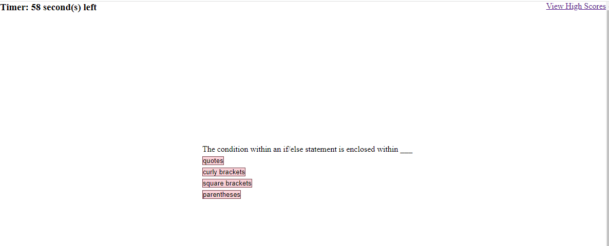

# Building a Web Dev Quiz in the Browser Using Javascript

## Description 

How well do you know web development? Come test your knowledge with this multiple choice quiz and record your scores. This quiz, which you can simply take in your browser,  is made functional mainly through Javascript. Upon starting, a timer will begin; if time runs out, the quiz ends even if you haven't finished all questions, and you will be presented with your final score based on the points you've gotten so far. During each question, immediately after selecting your answer, answers will be color-coded to let you know whether you selected the right option. If you select the right answer, you gain points. If you select the wrong answer, you will lose more time on the timer. At the very end, you can enter a name, and it will be recorded locally in your browser along with your final score. You can view your top 5 most recent scores to see how you improve! 

In terms of code, the quiz is broken up into several pages each with their own Javascript page. The index page holds the main features of the quiz, namely the questions and functionality of the quiz. When certain conditions are met, the index will lead to the end page of the game, which is where you can locally store a name of your choosing as well as your score for your most recent run through the quiz. These scores can be optionally viewed through the last provided page for the project, the highscore page. 

Feel free to modify and add more questions to test your friends! 

### Acknowledgements

I would like to credit Web Dev Simplified on Youtube for having a template for this project that I used as a guide for a large portion of this project. 

### Technologies 
- HTML5
- CSS3
- Javascript/ECMAScript6

### Final Page Image

### Link 
[Final page link](https://reversedentistry.github.io/Coding-Quiz-with-Javascript/)